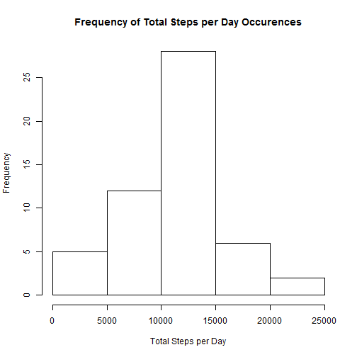
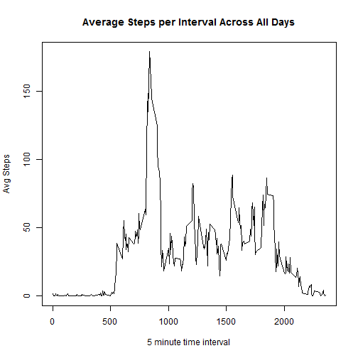
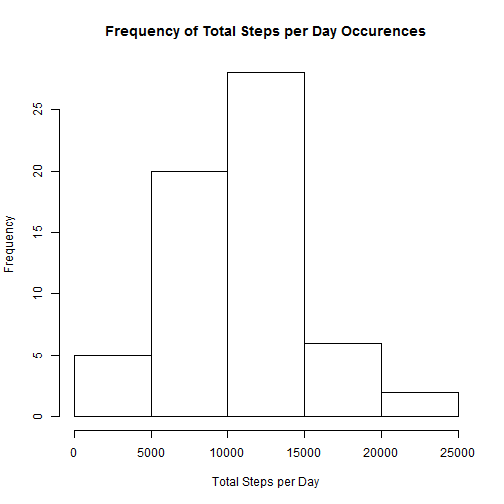
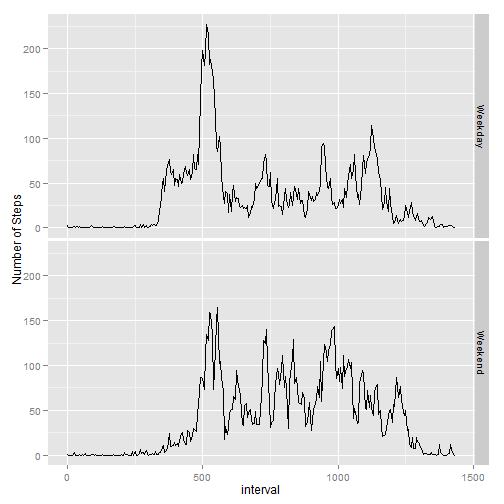

## Read the activiy data from the csv file, unzip the file.


```r
# Load library
library(ggplot2)
```

```
## Need help? Try the ggplot2 mailing list: http://groups.google.com/group/ggplot2.
```

```r
library(plyr)

#get the file
url <- "http://d396qusza40orc.cloudfront.net/repdata/data/activity.zip"

# Load and preprocess the data
# assume zip file has been downloaded already
filename <- "./activity.zip"

#download unzip the file if found
if (!file.exists(filename)) {
    download.file(url, filename)
}
unzip(filename, exdir=".")

#conditionally load the dataset
if (!exists("activity")) {
    activity <- read.csv("./activity.csv", header=TRUE, sep=",", 
                           quote="\"", na.strings="NA")
}
```

## What is mean total number of steps taken per day?

###First, Total Steps per Day Histogram

```r
totalStepsPerDay <- aggregate(steps ~ date, data=activity, sum)
hist(totalStepsPerDay$steps, main="Frequency of Total Steps per Day Occurences", 
                             xlab="Total Steps per Day")
```

 

The mean total steps taken per day is:

```
## [1] 10766.19
```

The median total steps taken per day is:

```
## [1] 10765
```

## What is the average daily activity pattern?

```r
totalStepsPerInt <- aggregate(steps ~ interval, data=activity, sum)
numDates <- length(levels(activity$date))
avgStepsPerInt <- mutate(totalStepsPerInt, steps = steps/numDates)
```

### Average Steps Per Time Interval Across All Days

```r
plot(avgStepsPerInt$steps ~ totalStepsPerInt$interval, type="l", 
      main="Average Steps per Interval Across All Days",
      xlab="5 minute time interval",
      ylab="Avg Steps")
```

 

### Time Interval of Maximum Avg

```r
subset(totalStepsPerInt, steps == max(steps))
```

```
##     interval steps
## 104      835 10927
```

## Imputing missing values

Replace NA step values with average vlaue for that time slot, rounded up
to a whole number.

First, determine the number of rows without step values (NA):


```
## [1] 2304
```
Now, Impute the null values.  We will replace the NAs with the
average for the specific 5 minute interval, rounded up.


```r
# create a new dataset and impute the missing values 
# replace NA values with the time slot averages rounded up
activityComplete <- activity
activityComplete$steps[is.na(activity$steps)] <- ceiling(avgStepsPerInt$steps)
```
Plot a histogram of Total Steps Per Day:

```r
totalStepsPerDayComplete <- aggregate(steps ~ date, data=activityComplete, sum)
hist(totalStepsPerDayComplete$steps, main="Frequency of Total Steps per Day Occurences", 
                             xlab="Total Steps per Day")
```

 
Report the Mean and Median values.

The mean total steps taken per day is:

```
## [1] 10598.82
```

The median total steps taken per day is:

```
## [1] 10395
```

## Are there differences in activity patterns between weekdays and weekends?

First, add a weekday column to the dataset, a factor
that indicates weekday or weekend.


```r
#function to return Weekend or Weekday
get.weekday <- function(x) {
    if (x == "Saturday" || x == "Sunday") {
        return("Weekend")
    } 
    else return("Weekday")
}

#add weekday column
activityComplete <- mutate(activityComplete, weekday = weekdays(as.Date(date)))
activityComplete <- mutate(activityComplete, weekday = as.factor(sapply(weekday,get.weekday)))
```
Now, aggregate by interval and weekday to get average steps per time interval
for weekend and weekday

```r
avgStepsPerIntWkd <- aggregate(activityComplete["steps"], 
                               by=activityComplete[c("interval","weekday")], FUN=mean)
```

Now, create a column to traack total elapsed min for each time interval.


```r
# add column for total min for the interval
avgStepsPerIntWkd <- mutate(avgStepsPerIntWkd, int_min = interval %/% 100 *60 + interval %% 100)
```

Finally, plot the reult in a panel.


```r
#plot the results
#qplot(int_min, steps, data=avgStepsPerIntWkd, facets=weekday~., geom="path")
g <- ggplot(avgStepsPerIntWkd, aes(int_min, steps))
g <- g + geom_line() + facet_grid(weekday ~ .) + labs(x = "interval", y = "Number of Steps") 
print(g)
```

 

